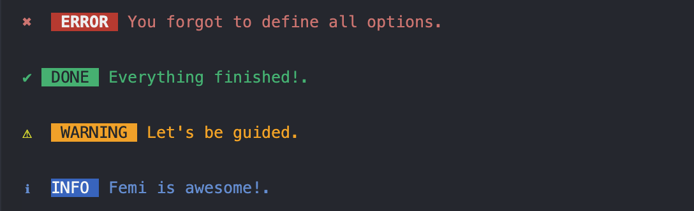

# CLI ALERTS

## API

### alert(options)

#### > options

Type: object <br>
Default: {}

You can specify the options below.

#### > type

Type: string <br>
Default: error

#### > msg

Type: string <br>
Default: `You forgot to define all options.`

#### > name

Type: string <br>
Default: `''` (Empty string)

<br>

## Usage

```
import {alert} from 'cli-notification

alert({
  type: `success`,
  msg: `Everything is complete!`
})

alert({
  type: `info`,
  msg: `Dont forget to use lowercase`
})
alert({
  type: `warning`,
  msg: `You didn't add something`
})
alert({
  type: `error`,
  msg: `Something went wrong`
})


```
